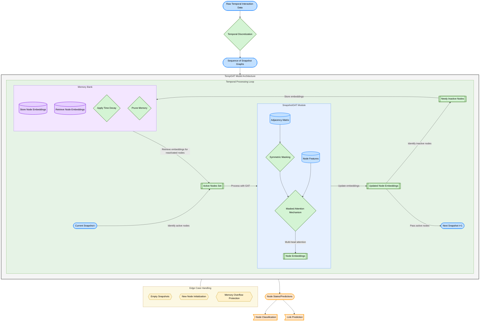

```mermaid
flowchart TB
    %% Define node styles
    classDef data fill:#c2e0ff,stroke:#1a83ff,stroke-width:2px,color:black
    classDef process fill:#d4f4d4,stroke:#38761d,stroke-width:2px,color:black
    classDef memory fill:#e6d0ff,stroke:#8a2be2,stroke-width:2px,color:black
    classDef prediction fill:#ffe6cc,stroke:#ff9900,stroke-width:2px,color:black
    classDef edgeCase fill:#fff2cc,stroke:#d6b656,stroke-width:2px,color:black
    
    %% Main data flow
    InputData([Raw Temporal Interaction Data]):::data --> TempDiscretization{Temporal Discretization}:::process
    TempDiscretization --> Snapshots([Sequence of Snapshot Graphs]):::data
    Snapshots --> TempGAT
    TempGAT --> Predictions([Node States/Predictions]):::prediction
    
    %% TempGAT architecture
    subgraph TempGAT[TempGAT Model Architecture]
        direction TB
        
        subgraph ProcessingLoop["Temporal Processing Loop"]
            direction LR
            CurrentSnapshot([Current Snapshot t]):::data --> | Identify active nodes | ActiveNodes[[Active Nodes Set]]:::process
            MemoryBank -->| Retrieve embeddings for reactivated nodes | ActiveNodes
            ActiveNodes --> | Process with GAT | SnapshotGAT
            SnapshotGAT --> | Update embeddings | UpdatedNodes[[Updated Node Embeddings]]:::process
            UpdatedNodes --> | Identify inactive nodes | InactiveNodes[[Newly Inactive Nodes]]:::process
            UpdatedNodes --> | Pass active nodes | NextSnapshot([Next Snapshot t+1]):::data
        end
        
        InactiveNodes -->|Store embeddings| MemoryBank
        
        subgraph SnapshotGAT[SnapshotGAT Module]
            direction TB
            AdjMatrix[(Adjacency Matrix)]:::data --> SymMask{Symmetric Masking}:::process
            SymMask --> MaskAttn{Masked Attention Mechanism}:::process
            NodeFeatures[(Node Features)]:::data --> MaskAttn
            MaskAttn --> |Multi-head attention| GAT_Output[[Node Embeddings]]:::process
        end
        
        subgraph MemoryBank[Memory Bank]
            direction TB
            StoreNode[(Store Node Embeddings)]:::memory
            RetrieveNode[(Retrieve Node Embeddings)]:::memory
            TimeDecay{Apply Time Decay}:::process
            PruneMemory{Prune Memory}:::process
        end
    end
    
    %% Downstream tasks
    Predictions --> NodeClass>Node Classification]:::prediction
    Predictions --> LinkPred>Link Prediction]:::prediction
    
    %% Edge cases
    subgraph EdgeCases[Edge Case Handling]
        direction TB
        EmptySnap{{Empty Snapshots}}:::edgeCase
        NewNodes{{New Node Initialization}}:::edgeCase
        MemoryOverflow{{Memory Overflow Protection}}:::edgeCase
    end
    
    TempGAT --- EdgeCases
    
    %% Style subgraphs
    style TempGAT fill:#f5f5f5,stroke:#333,stroke-width:2px
    style ProcessingLoop fill:#e6f3e6,stroke:#6aa84f,stroke-width:1px
    style SnapshotGAT fill:#e6f0ff,stroke:#4285f4,stroke-width:1px
    style MemoryBank fill:#f3e6ff,stroke:#9a67ea,stroke-width:1px
    style EdgeCases fill:#fcf8e3,stroke:#c09853,stroke-width:1px
```