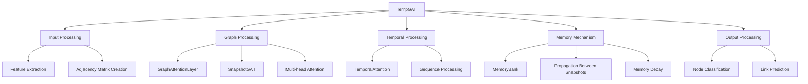
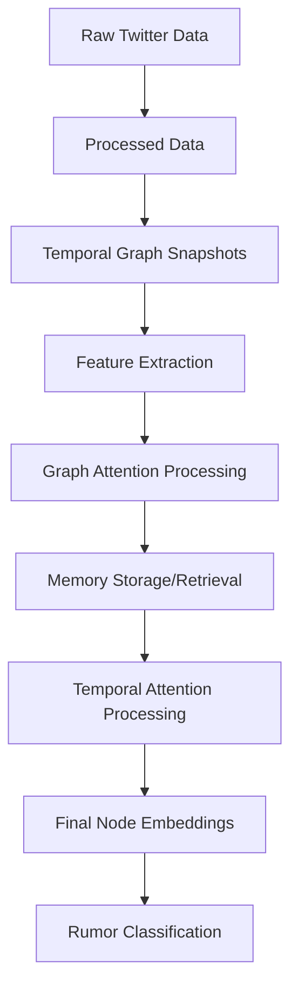

# TempGAT: Temporal Graph Attention Network for Twitter Rumor Analysis

## Overview

TempGAT (Temporal Graph Attention Network) is a deep learning architecture designed for analyzing temporal graph data, with a specific application to Twitter rumor detection. The model achieves approximately 77% accuracy on the PHEME dataset in just one epoch, demonstrating its effectiveness for rumor classification tasks.

This repository contains the implementation of TempGAT, along with scripts for downloading, preprocessing, and analyzing Twitter rumor datasets.

## Table of Contents

- [TempGAT: Temporal Graph Attention Network for Twitter Rumor Analysis](#tempgat-temporal-graph-attention-network-for-twitter-rumor-analysis)
  - [Overview](#overview)
  - [Table of Contents](#table-of-contents)
  - [Architecture Overview](#architecture-overview)
  - [Key Components](#key-components)
    - [1. GraphAttentionLayer](#1-graphattentionlayer)
    - [2. SnapshotGAT](#2-snapshotgat)
    - [3. TemporalAttention](#3-temporalattention)
    - [4. MemoryBank](#4-memorybank)
    - [5. TempGAT](#5-tempgat)
  - [Data Flow](#data-flow)
  - [Installation and Setup](#installation-and-setup)
  - [Usage](#usage)
  - [Performance](#performance)
  - [Implementation Details](#implementation-details)
    - [Temporal Graph Structure](#temporal-graph-structure)
    - [Memory Mechanism](#memory-mechanism)
    - [Attention Mechanisms](#attention-mechanisms)
  - [References](#references)

## Architecture Overview

TempGAT is a temporal graph neural network that combines Graph Attention Networks (GAT) with temporal processing and a memory mechanism. The architecture is designed to handle the dynamic nature of social media interactions, where users and tweets appear and disappear over time.



## Key Components

### 1. GraphAttentionLayer

The `GraphAttentionLayer` class implements the Graph Attention mechanism, allowing the model to focus on the most relevant connections in the graph.

### 2. SnapshotGAT

The `SnapshotGAT` class processes individual graph snapshots, applying graph attention to capture the structural relationships within each time window.

### 3. TemporalAttention

The `TemporalAttention` class captures dependencies across time, allowing the model to attend to node states across different time steps.

### 4. MemoryBank

The `MemoryBank` class stores and retrieves node embeddings across time, applying time decay and pruning to maintain efficiency.

### 5. TempGAT

The `TempGAT` class integrates all components, processing temporal graph data and producing node embeddings for rumor classification.

## Data Flow

The data flows through the system as follows:



1. **Data Loading**: Raw Twitter rumor data is loaded and processed.
2. **Temporal Graph Creation**: The data is converted into a sequence of temporal graph snapshots.
3. **Feature Extraction**: Node features are extracted from the data.
4. **Model Processing**:
   - Each snapshot is processed by the `SnapshotGAT` component.
   - Node embeddings are stored in the `MemoryBank`.
   - Temporal dependencies are captured by the `TemporalAttention` component.
5. **Prediction**: The final node embeddings are used for rumor detection.

## Installation and Setup

```bash
# Clone the repository
git clone https://github.com/yourusername/tempgat.git
cd tempgat

# Install dependencies
pip install -r requirements.txt

# Download and preprocess data
python download_twitter_rumor.py --dataset pheme
python preprocess_dataset.py --raw_data_dir data/twitter_rumor/processed --processed_data_dir data/twitter_rumor/processed --window_size 60
```

## Usage

To run the TempGAT model on the PHEME dataset:

```bash
python run_twitter_rumor_pipeline.py --dataset pheme --window_size 60 --num_epochs 4
```

To skip the download and preprocessing steps:

```bash
python run_twitter_rumor_pipeline.py --skip-download --dataset pheme
```

## Performance

The TempGAT model achieves approximately 77% accuracy on the PHEME dataset in just one epoch. The key parameters that contribute to this performance are:

- `hidden_dim`: 64
- `output_dim`: 32
- `num_heads`: 8
- `memory_decay`: 0.9
- `dropout`: 0.2
- `learning_rate`: 0.001

## Implementation Details

### Temporal Graph Structure

The temporal graph structure represents the Twitter rumor data as a sequence of graph snapshots, where each snapshot captures the state of the graph at a specific time window.

```python
class TemporalGraph:
    def __init__(self, window_size: int = 15):
        self.window_size = window_size  # in minutes
        self.snapshots = []
        self.node_id_map = {}  # Maps external node IDs to internal consecutive IDs
        self.reverse_node_id_map = {}  # Maps internal IDs back to external IDs
        self.feature_dim = None
        self.num_nodes = 0
        self.node_features = {}  # Maps node_id to features
```

### Memory Mechanism

The memory mechanism allows the model to maintain information about nodes across time, even when they become inactive.

```python
class MemoryBank:
    def __init__(self, 
                decay_factor: float = 0.9, 
                max_size: int = 10000,
                pruning_threshold: int = 100):
        self.node_embeddings = {}  # Maps node_id to (embedding, last_updated, access_count)
        self.decay_factor = decay_factor
        self.max_size = max_size
        self.pruning_threshold = pruning_threshold
```

### Attention Mechanisms

The TempGAT architecture uses two types of attention:

1. **Graph Attention**: Captures structural relationships within each snapshot.
2. **Temporal Attention**: Captures dependencies across time.

## References

For more detailed information about the TempGAT architecture, please refer to the following documents:

- [TempGAT Architecture Analysis](TempGAT_Architecture_Analysis.md)
- [TempGAT Architecture Diagrams](TempGAT_Architecture_Diagrams.md)
- [TempGAT Architecture Analysis Plan](TempGAT_Architecture_Analysis_Plan.md)

For more information about the Twitter rumor datasets, please refer to:

- [README_TWITTER_RUMOR.md](README_TWITTER_RUMOR.md)
