# TempGAT Architecture Diagrams

This document provides detailed Mermaid diagrams of the Temporal Graph Attention Network (TempGAT) architecture, showing both high-level overview and component-specific details.

## 1. High-Level Architecture Overview

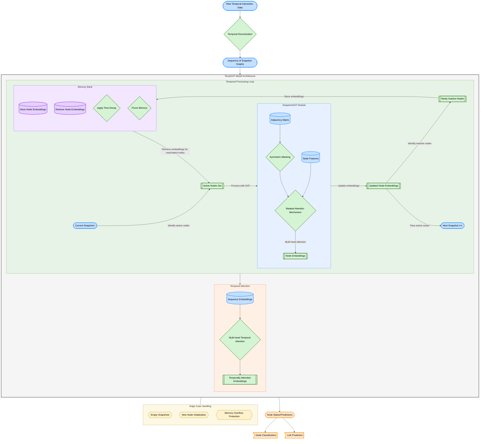

The high-level architecture shows how TempGAT processes temporal graph data through a sequence of snapshots, using memory to maintain node states between active periods and applying temporal attention to capture long-term dependencies.

## 2. Data Processing Component (TemporalGraph)

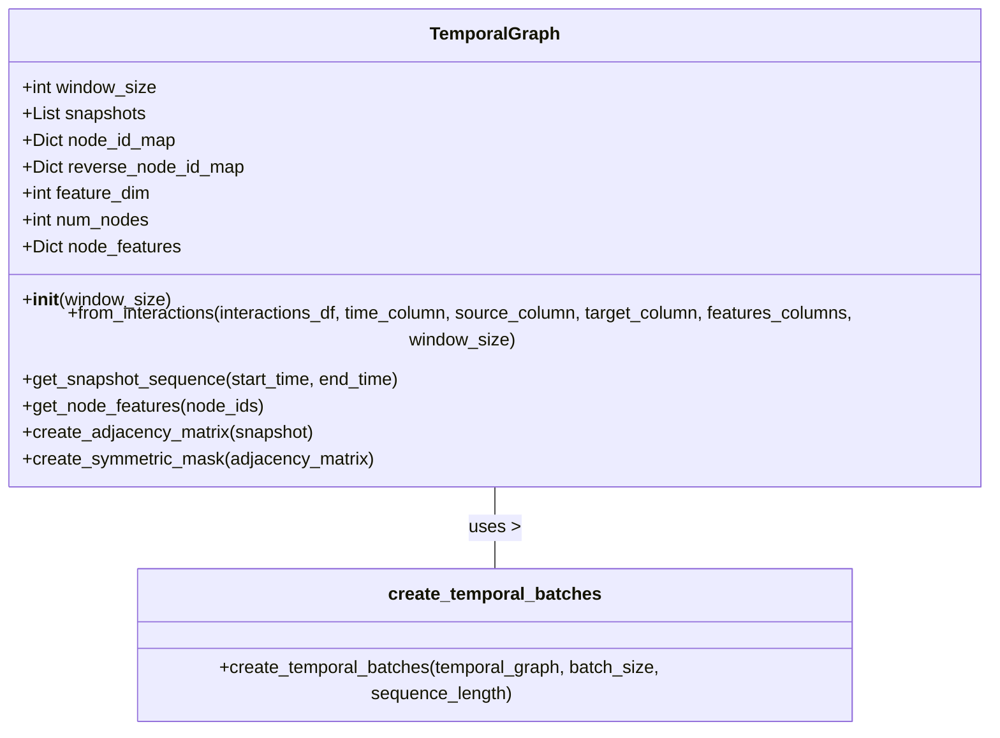

```mermaid
flowchart TB
    %% Define node styles
    classDef data fill:#c2e0ff,stroke:#1a83ff,stroke-width:2px,color:black
    classDef process fill:#d4f4d4,stroke:#38761d,stroke-width:2px,color:black
    classDef output fill:#ffe6cc,stroke:#ff9900,stroke-width:2px,color:black
    
    %% Data processing flow
    RawData([Raw Interaction Data]):::data --> SortData{Sort by Timestamp}:::process
    SortData --> ConvertTime{Convert to Minutes}:::process
    ConvertTime --> CreateNodeMap{Create Node ID Mapping}:::process
    
    CreateNodeMap --> ExtractFeatures{Extract Node Features}:::process
    ExtractFeatures --> OneHotEncoding{One-Hot Encoding}:::process
    ExtractFeatures --> FeatureExtraction{Feature Extraction}:::process
    
    OneHotEncoding --> CreateSnapshots{Create Snapshots}:::process
    FeatureExtraction --> CreateSnapshots
    
    CreateSnapshots --> WindowInteractions{Get Window Interactions}:::process
    WindowInteractions --> ActiveNodes{Identify Active Nodes}:::process
    ActiveNodes --> CreateAdjMatrix{Create Adjacency Matrix}:::process
    CreateAdjMatrix --> SnapshotCreation{Create Snapshot}:::process
    
    SnapshotCreation --> Snapshots([Sequence of Snapshots]):::output
    
    %% Batch creation
    Snapshots --> CreateSequences{Create Sequences}:::process
    CreateSequences --> CreateBatches{Create Batches}:::process
    CreateBatches --> TemporalBatches([Temporal Batches]):::output
```

The TemporalGraph component handles the conversion of raw temporal interaction data into a sequence of snapshot graphs. It segments the timeline into fixed windows, identifies active nodes in each window, and creates adjacency matrices for each snapshot.

## 3. Memory Management Component (MemoryBank)

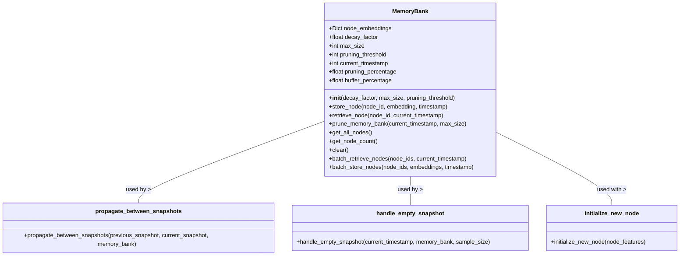

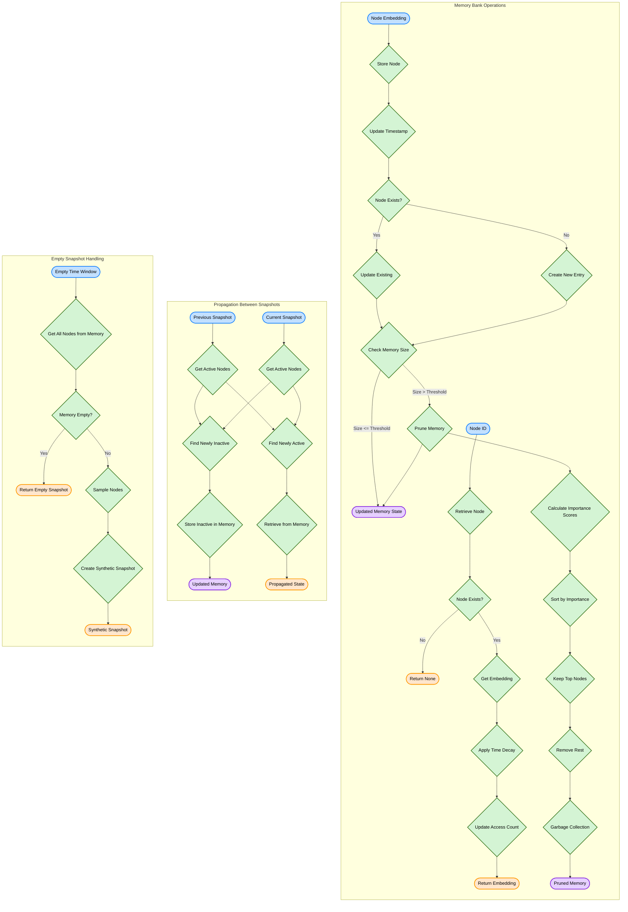

The MemoryBank component efficiently stores and retrieves node embeddings, implementing time-decay for long-stored embeddings and pruning mechanisms to prevent memory overflow. It's a critical component for maintaining node states between active periods.

## 4. Graph Attention Network Component (SnapshotGAT)

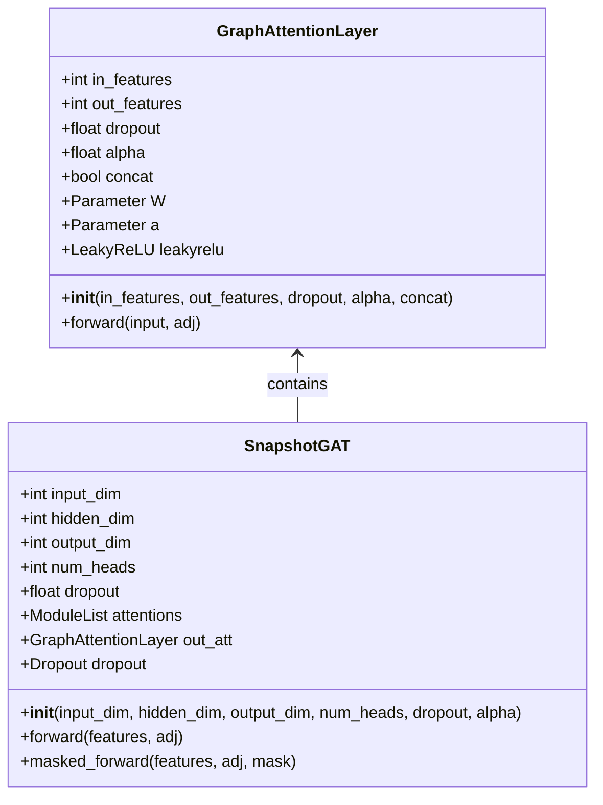

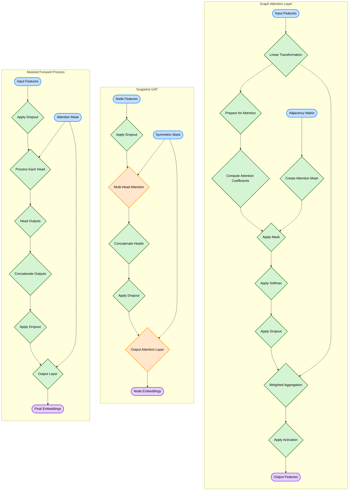

The SnapshotGAT component implements a modified Graph Attention Network that handles variable-sized inputs through masking. It maintains the multi-head attention mechanism from the original GAT while adapting it for temporal graph processing.

## 5. Temporal Attention Component

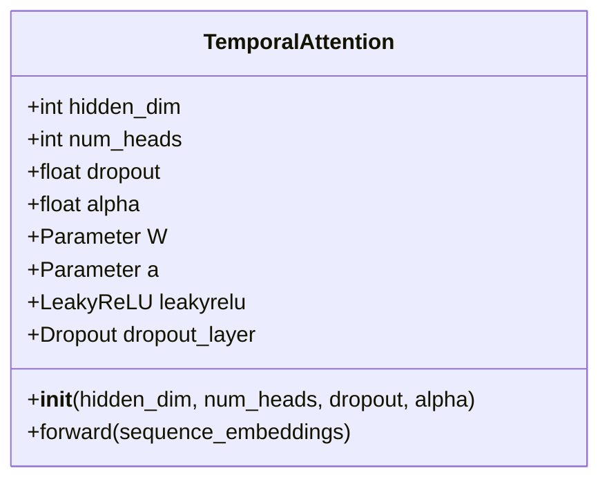

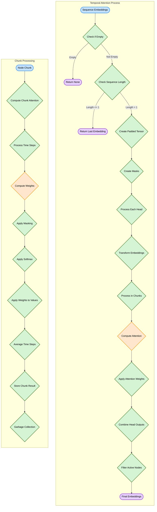

The TemporalAttention component applies attention mechanisms across time to capture long-term dependencies in node embeddings. It uses a memory-optimized implementation to handle large graphs efficiently.

## 6. TempGAT Main Model

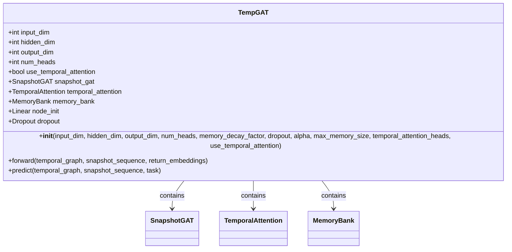

```mermaid
flowchart TB
    %% Define node styles
    classDef data fill:#c2e0ff,stroke:#1a83ff,stroke-width:2px,color:black
    classDef process fill:#d4f4d4,stroke:#38761d,stroke-width:2px,color:black
    classDef memory fill:#e6d0ff,stroke:#8a2be2,stroke-width:2px,color:black
    classDef attention fill:#ffe6cc,stroke:#ff9900,stroke-width:2px,color:black
    classDef output fill:#ffcccc,stroke:#ff6666,stroke-width:2px,color:black
    
    %% TempGAT Forward Pass
    subgraph TempGATForward[TempGAT Forward Pass]
        direction TB
        
        SnapshotSequence([Snapshot Sequence]):::data --> ProcessSnapshots{Process Each Snapshot}:::process
        
        ProcessSnapshots --> CheckEmpty{Check if Empty}:::process
        CheckEmpty -->|Empty| HandleEmpty{Handle Empty Snapshot}:::process
        CheckEmpty -->|Not Empty| GetActiveNodes{Get Active Nodes}:::process
        
        HandleEmpty --> GetActiveNodes
        
        GetActiveNodes --> GetFeatures{Get Node Features}:::process
        GetFeatures --> CreateAdjMatrix{Create Adjacency Matrix}:::process
        CreateAdjMatrix --> CreateMask{Create Symmetric Mask}:::process
        
        CreateMask --> InitializeEmbeddings{Initialize Embeddings}:::process
        
        InitializeEmbeddings --> CheckPrevious{Previous Snapshot?}:::process
        CheckPrevious -->|Yes| PropagateEmbeddings{Propagate Embeddings}:::process
        CheckPrevious -->|No| InitializeNew{Initialize New Nodes}:::process
        
        PropagateEmbeddings --> ProcessGAT{Process with GAT}:::attention
        InitializeNew --> ProcessGAT
        
        ProcessGAT --> StoreInMemory{Store in Memory}:::memory
        StoreInMemory --> SaveSnapshot{Save Snapshot Result}:::process
        SaveSnapshot --> UpdatePrevious{Update Previous Snapshot}:::process
        
        UpdatePrevious --> GarbageCollection{Garbage Collection}:::process
        GarbageCollection --> NextSnapshot{Next Snapshot}:::process
        
        NextSnapshot --> CheckTemporalAttention{Use Temporal Attention?}:::process
        CheckTemporalAttention -->|Yes| ApplyTemporalAttention{Apply Temporal Attention}:::attention
        CheckTemporalAttention -->|No| ReturnLastEmbeddings{Return Last Embeddings}:::output
        
        ApplyTemporalAttention --> UpdateLastEmbeddings{Update Last Embeddings}:::process
        UpdateLastEmbeddings --> ReturnLastEmbeddings
    end
    
    %% TempGAT Predict
    subgraph TempGATPredict[TempGAT Prediction]
        direction TB
        
        InputSequence([Input Sequence]):::data --> ForwardPass{Forward Pass}:::process
        ForwardPass --> GetEmbeddings{Get Embeddings}:::process
        
        GetEmbeddings --> CheckTask{Check Task}:::process
        
        CheckTask -->|Node Classification| ApplySoftmax{Apply Softmax}:::process
        ApplySoftmax --> NodePredictions([Node Predictions]):::output
        
        CheckTask -->|Link Prediction| CreateNodePairs{Create Node Pairs}:::process
        CreateNodePairs --> ComputeScores{Compute Edge Scores}:::process
        ComputeScores --> EdgePredictions([Edge Predictions]):::output
    end
```

## 7. Training System

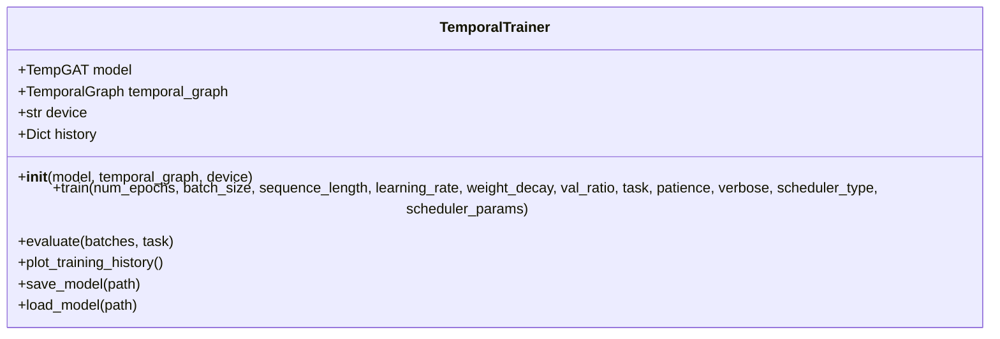

```mermaid
flowchart TB
    %% Define node styles
    classDef data fill:#c2e0ff,stroke:#1a83ff,stroke-width:2px,color:black
    classDef process fill:#d4f4d4,stroke:#38761d,stroke-width:2px,color:black
    classDef training fill:#ffe6cc,stroke:#ff9900,stroke-width:2px,color:black
    classDef output fill:#ffcccc,stroke:#ff6666,stroke-width:2px,color:black
    
    %% Training Process
    subgraph TrainingProcess[Training Process]
        direction TB
        
        InitializeTrainer([Initialize Trainer]):::process --> CreateOptimizer{Create Optimizer}:::process
        CreateOptimizer --> CreateScheduler{Create Scheduler}:::process
        CreateScheduler --> CreateBatches{Create Temporal Batches}:::process
        
        CreateBatches --> SplitData{Split Train/Val}:::process
        SplitData --> TrainingLoop{Training Loop}:::training
        
        TrainingLoop --> ProcessBatch{Process Each Batch}:::process
        ProcessBatch --> ProcessSequence{Process Each Sequence}:::process
        
        ProcessSequence --> ForwardPass{Forward Pass}:::process
        ForwardPass --> ComputeLoss{Compute Loss}:::process
        ComputeLoss --> Backpropagation{Backpropagation}:::process
        Backpropagation --> UpdateWeights{Update Weights}:::process
        
        UpdateWeights --> AccumulateLoss{Accumulate Loss}:::process
        AccumulateLoss --> GarbageCollection{Garbage Collection}:::process
        
        GarbageCollection --> ValidationPhase{Validation Phase}:::process
        ValidationPhase --> UpdateScheduler{Update Scheduler}:::process
        
        UpdateScheduler --> EarlyStoppingCheck{Early Stopping Check}:::process
        EarlyStoppingCheck -->|Continue| NextEpoch{Next Epoch}:::process
        EarlyStoppingCheck -->|Stop| ReturnHistory{Return History}:::output
        
        NextEpoch --> TrainingLoop
    end
    
    %% Evaluation Process
    subgraph EvaluationProcess[Evaluation Process]
        direction TB
        
        EvalBatches([Evaluation Batches]):::data --> ModelEval{Set Model to Eval}:::process
        ModelEval --> ProcessEvalBatch{Process Each Batch}:::process
        
        ProcessEvalBatch --> EvalForwardPass{Forward Pass}:::process
        EvalForwardPass --> ComputeEvalLoss{Compute Loss}:::process
        
        ComputeEvalLoss --> CollectPredictions{Collect Predictions}:::process
        CollectPredictions --> ComputeMetrics{Compute Metrics}:::process
        
        ComputeMetrics --> ReturnResults{Return Results}:::output
    end
```

The training system handles the training, validation, and evaluation of TempGAT models on temporal graph data. It supports different learning rate schedulers, early stopping, and various evaluation metrics.

## 8. Data Flow Diagram

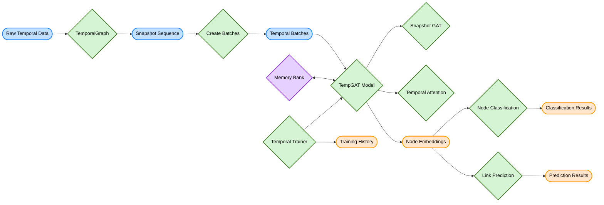

This data flow diagram shows how information moves through the entire TempGAT system, from raw temporal data to final predictions, highlighting the key processing steps and components involved.
