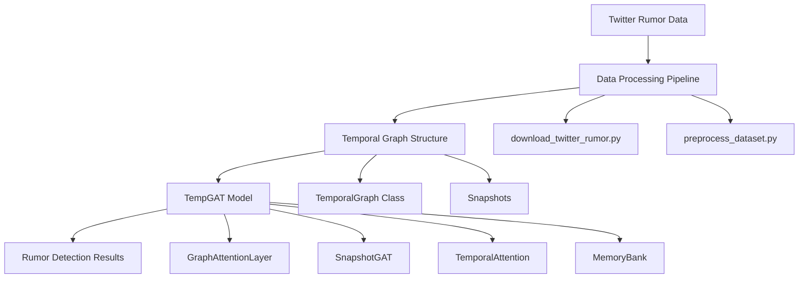
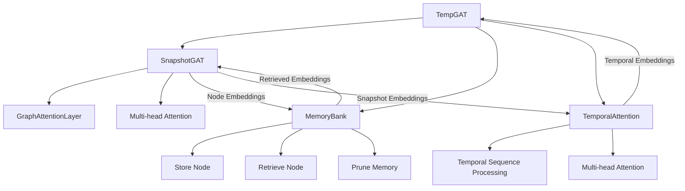
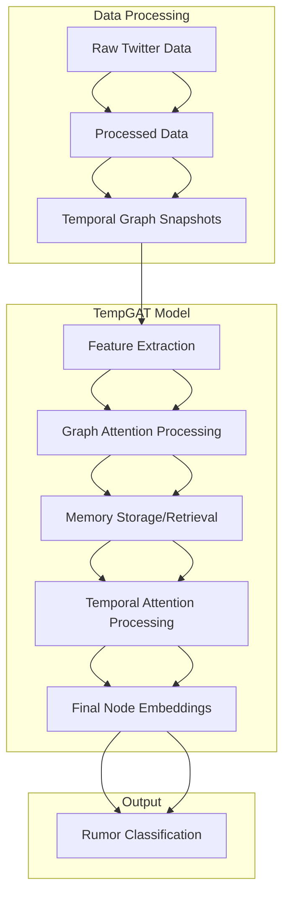
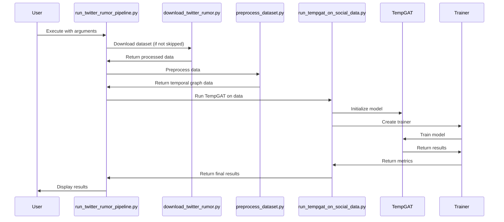
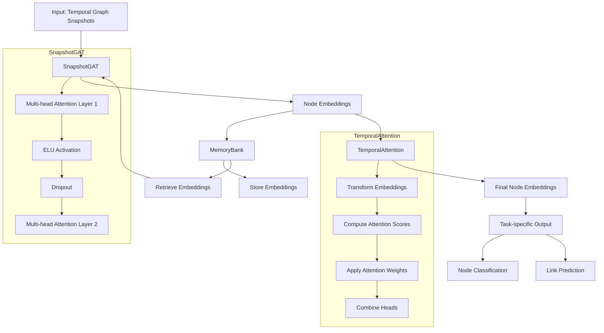
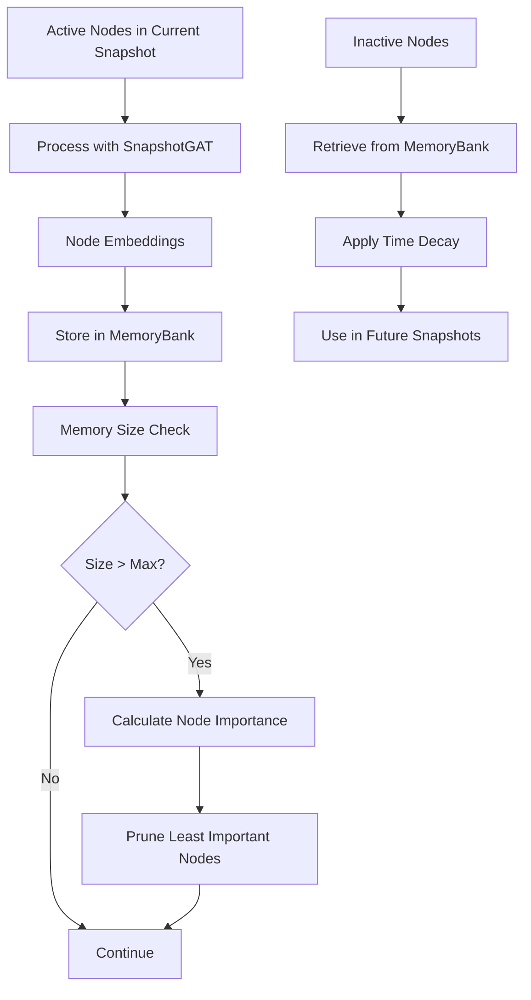
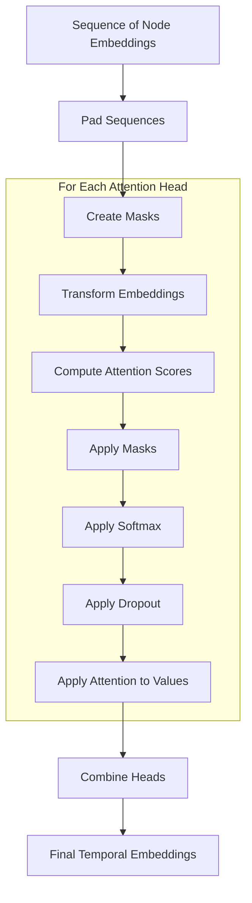
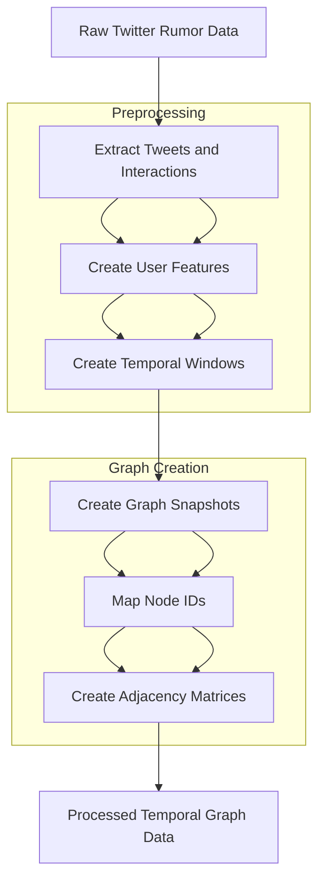
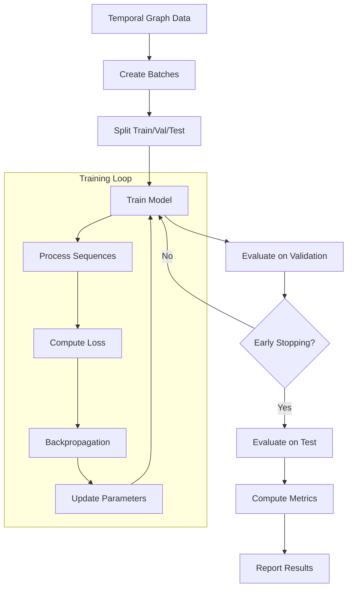
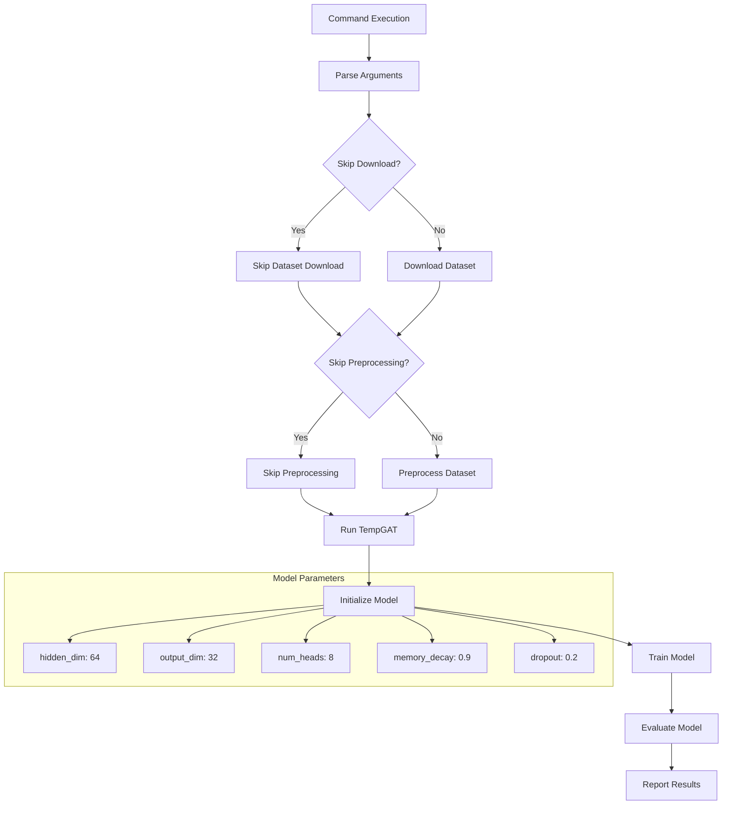

# TempGAT Architecture Diagrams

This document contains various diagrams illustrating the TempGAT architecture, component interactions, and data flow for Twitter rumor analysis.

## 1. System Overview

This diagram shows the high-level components of the TempGAT system:

## 2. Component Interactions

This diagram shows how the different components of the TempGAT model interact:

## 3. Data Flow Diagram

This diagram illustrates how data flows through the TempGAT system:

## 4. Pipeline Execution

This diagram shows the execution flow of the Twitter rumor pipeline:

## 5. TempGAT Architecture

This diagram shows the detailed architecture of the TempGAT model:

## 6. Memory Mechanism

This diagram illustrates how the memory mechanism works:

## 7. Temporal Attention Mechanism

This diagram shows how the temporal attention mechanism works:

## 8. Data Processing Pipeline

This diagram illustrates the data processing pipeline:

## 9. Training and Evaluation Workflow

This diagram shows the training and evaluation workflow:

## 10. Command Execution Flow

This diagram shows the execution flow of the command `python run_twitter_rumor_pipeline.py --skip-download --dataset pheme`:

These diagrams provide a visual representation of the TempGAT architecture and its components, helping to understand how the system works for Twitter rumor analysis.
